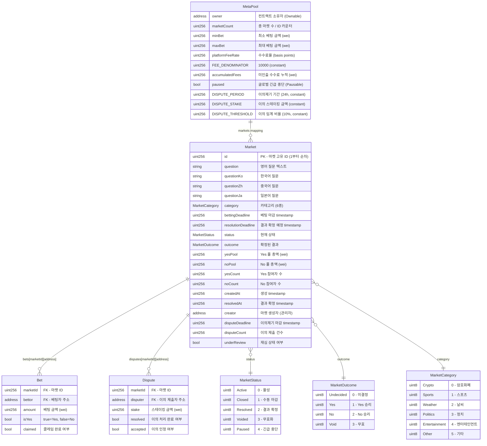
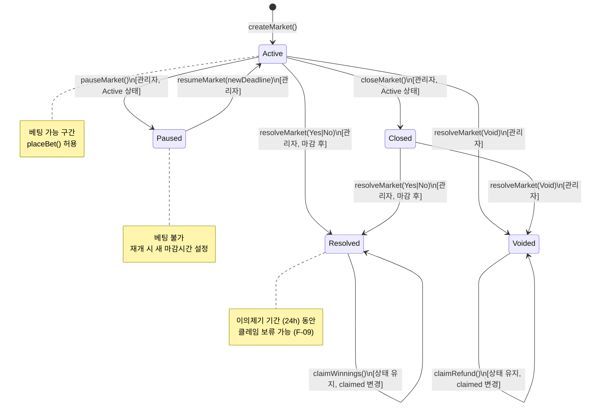
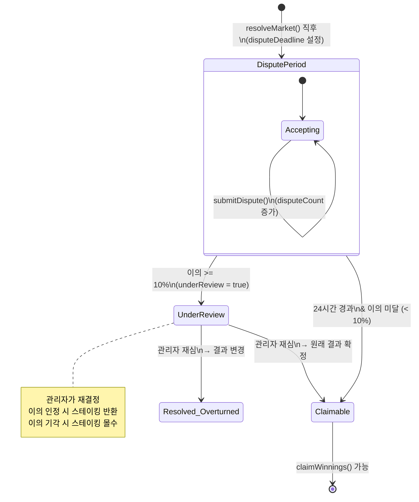

# MetaPool -- 온체인 데이터 모델 (ERD)

## 1. 개요

MetaPool은 온체인 전용 아키텍처로, 별도의 데이터베이스 서버가 존재하지 않는다. 모든 상태 데이터는 MetaPool.sol 스마트 컨트랙트의 storage에 저장되며, 이벤트 로그가 오프체인 인덱싱의 근거가 된다.

따라서 이 문서의 "엔티티"는 전통적인 DB 테이블이 아니라 **Solidity struct, mapping, enum, state variable**을 의미한다. 관계(Relationship)는 mapping 키 구조로 표현된다.

### 데이터 접근 방식

| 구분 | 방법 | 가스비 |
|------|------|--------|
| 현재 상태 읽기 | view 함수 (ethers.js call) | 없음 |
| 상태 변경 | 트랜잭션 (MetaMask 서명) | 발생 |
| 이력 조회 | 이벤트 로그 (getLogs / 이벤트 리스닝) | 없음 |

### 커버리지

이 데이터 모델은 features.md의 F-01 ~ F-32 전체 기능을 커버한다.

| 데이터 모델 | 커버 기능 |
|------------|-----------|
| Market struct | F-01, F-02, F-03, F-04, F-11, F-14~F-17, F-21, F-29~F-32 |
| Bet struct / bets mapping | F-05, F-06, F-07, F-08, F-18~F-20, F-22, F-23 |
| Dispute struct / disputes mapping | F-09, F-10 |
| State Variables (설정) | F-12, F-13 |
| Events (이벤트 로그) | F-24, F-25, F-26, F-28, F-31 |
| i18n (Market 다국어 필드) | F-27, F-29 |

---

## 2. 엔티티 관계 다이어그램 (Mermaid)



---

## 3. 엔티티별 상세 설명

### 3.1 MetaPool (컨트랙트 글로벌 상태)

컨트랙트 레벨의 전역 상태 변수. 배포 시 초기화되며 관리자가 런타임에 변경 가능하다.

| 변수 | 타입 | 초기값 | 변경 | 관련 기능 | 설명 |
|------|------|--------|------|-----------|------|
| owner | address | 배포자 | transferOwnership() | F-01,F-03,F-11,F-12 | 관리자 주소 (Ownable) |
| marketCount | uint256 | 0 | createMarket()에서 증가 | F-01 | 마켓 ID 카운터 |
| minBet | uint256 | 100 ether | updateSettings() | F-05,F-06,F-12 | 최소 베팅 금액 (100 META) |
| maxBet | uint256 | 100000 ether | updateSettings() | F-05,F-06,F-12 | 최대 베팅 금액 (100,000 META) |
| platformFeeRate | uint256 | 200 | updateSettings() | F-03,F-07,F-12 | 수수료율 (200 = 2%) |
| FEE_DENOMINATOR | uint256 | 10000 | immutable | F-03,F-07 | 수수료 분모 (constant) |
| accumulatedFees | uint256 | 0 | resolveMarket()에서 증가 | F-12 | 미인출 수수료 누적액 |
| paused | bool | false | pause()/unpause() | F-05,F-11 | 글로벌 중단 (Pausable) |
| DISPUTE_PERIOD | uint256 | 86400 | immutable | F-09 | 이의제기 기간 (24시간, constant) |
| DISPUTE_STAKE | uint256 | 1000 ether | immutable | F-10 | 이의 스테이킹 금액 (1,000 META, constant) |
| DISPUTE_THRESHOLD | uint256 | 1000 | immutable | F-09 | 이의 임계 비율 (1000 = 10%, basis points) |

### 3.2 Market Struct

마켓의 모든 정보를 담는 핵심 구조체. `mapping(uint256 => Market) public markets`로 저장.

| 필드 | 타입 | 설명 | 관련 기능 |
|------|------|------|-----------|
| id | uint256 | 마켓 고유 ID (1부터 순차 증가) | F-01 |
| question | string | 영어 질문 텍스트 (기본 언어) | F-01,F-14,F-29,F-32 |
| questionKo | string | 한국어 질문 | F-01,F-29 |
| questionZh | string | 중국어 질문 | F-01,F-29 |
| questionJa | string | 일본어 질문 | F-01,F-29 |
| category | MarketCategory | 6개 카테고리 중 하나 | F-02,F-15 |
| bettingDeadline | uint256 | 베팅 마감 timestamp | F-01,F-05,F-14,F-16 |
| resolutionDeadline | uint256 | 결과 확정 예정 timestamp | F-01,F-03 |
| status | MarketStatus | 현재 상태 (5단계) | F-03,F-04,F-05,F-11,F-14,F-21,F-22 |
| outcome | MarketOutcome | 확정된 결과 | F-03,F-07,F-08,F-21 |
| yesPool | uint256 | Yes 풀 총액 (wei) | F-05,F-06,F-07,F-14,F-16,F-17,F-19,F-31 |
| noPool | uint256 | No 풀 총액 (wei) | F-05,F-06,F-07,F-14,F-16,F-17,F-19,F-31 |
| yesCount | uint256 | Yes 참여자 수 | F-05,F-14,F-16 |
| noCount | uint256 | No 참여자 수 | F-05,F-14,F-16 |
| createdAt | uint256 | 마켓 생성 timestamp | F-01,F-30 |
| resolvedAt | uint256 | 결과 확정 timestamp | F-03,F-09 |
| creator | address | 마켓 생성 관리자 주소 | F-01 |
| disputeDeadline | uint256 | 이의제기 마감 timestamp (resolvedAt + 24h) | F-09 |
| disputeCount | uint256 | 이의 제출 건수 | F-09,F-10 |
| underReview | bool | 재심 상태 (이의 임계 초과 시 true) | F-09 |

### 3.3 Bet Struct

개별 베팅 기록. `mapping(uint256 => mapping(address => Bet)) public bets`로 저장.
마켓당 사용자별 1건의 베팅만 존재하며, 추가 베팅은 amount에 합산.

| 필드 | 타입 | 설명 | 관련 기능 |
|------|------|------|-----------|
| amount | uint256 | 베팅 금액 (wei). 추가 베팅 시 누적 합산 | F-05,F-06,F-07,F-08,F-19,F-22,F-23 |
| isYes | bool | 베팅 방향. true=Yes, false=No | F-05,F-06,F-07,F-22 |
| claimed | bool | 클레임/환불 완료 여부 (이중 클레임 방지) | F-07,F-08,F-22,F-23 |

**접근 패턴**: `bets[marketId][userAddress]`로 O(1) 조회. amount == 0이면 베팅 기록 없음을 의미.

### 3.4 Dispute Struct (F-09, F-10)

이의제기 기록. `mapping(uint256 => mapping(address => Dispute)) public disputes`로 저장.

| 필드 | 타입 | 설명 | 관련 기능 |
|------|------|------|-----------|
| stake | uint256 | 스테이킹 금액 (1,000 META) | F-10 |
| resolved | bool | 이의 처리 완료 여부 | F-10 |
| accepted | bool | 이의 인정 여부 (true: 스테이킹 반환, false: 몰수) | F-10 |

**접근 패턴**: `disputes[marketId][disputerAddress]`로 O(1) 조회. stake == 0이면 이의 미제출.

### 3.5 Enums

#### MarketStatus

마켓의 라이프사이클을 정의하는 상태 머신.

| 값 | 이름 | 설명 | 진입 조건 |
|----|------|------|-----------|
| 0 | Active | 베팅 가능한 활성 상태 | createMarket() 또는 resumeMarket() |
| 1 | Closed | 수동 조기 마감 | closeMarket() (관리자) |
| 2 | Resolved | 결과 확정 (Yes/No) | resolveMarket(Yes/No) |
| 3 | Voided | 무효화 (전액 환불) | resolveMarket(Void) |
| 4 | Paused | 긴급 중단 | pauseMarket() (관리자) |

#### MarketOutcome

마켓 결과 유형.

| 값 | 이름 | 설명 |
|----|------|------|
| 0 | Undecided | 아직 미결정 (초기값) |
| 1 | Yes | Yes 승리 |
| 2 | No | No 승리 |
| 3 | Void | 무효 |

#### MarketCategory

마켓 분류 카테고리 (F-02).

| 값 | 이름 | 설명 |
|----|------|------|
| 0 | Crypto | 암호화폐 |
| 1 | Sports | 스포츠 |
| 2 | Weather | 날씨 |
| 3 | Politics | 정치 |
| 4 | Entertainment | 엔터테인먼트 |
| 5 | Other | 기타 |

---

## 4. Mapping 구조 (Storage Layout)

```
storage
├── markets: mapping(uint256 => Market)
│   ├── markets[1] => Market { id:1, question:"...", ... }
│   ├── markets[2] => Market { id:2, question:"...", ... }
│   └── ...
├── bets: mapping(uint256 => mapping(address => Bet))
│   ├── bets[1][0xAlice] => Bet { amount: 500e18, isYes: true, claimed: false }
│   ├── bets[1][0xBob]   => Bet { amount: 300e18, isYes: false, claimed: false }
│   └── ...
├── disputes: mapping(uint256 => mapping(address => Dispute))
│   ├── disputes[1][0xAlice] => Dispute { stake: 1000e18, resolved: false, accepted: false }
│   └── ...
├── marketCount: uint256
├── minBet: uint256
├── maxBet: uint256
├── platformFeeRate: uint256
├── accumulatedFees: uint256
└── (Ownable: owner, Pausable: paused)
```

---

## 5. 마켓 상태 전이 다이어그램



### 이의제기 하위 상태 (F-09, F-10)

Resolved 상태 내에서 이의제기 기간 동안의 하위 흐름:



---

## 6. 이벤트 목록

이벤트 로그는 온체인 데이터의 이력 조회 수단이다. 프론트엔드에서 실시간 UI 갱신(F-14, F-17, F-21)과 통계 집계(F-24~F-26, F-31)에 활용한다.

### 6.1 마켓 관련 이벤트

| 이벤트 | 파라미터 | 발생 시점 | 관련 기능 |
|--------|----------|-----------|-----------|
| MarketCreated | `uint256 indexed marketId, string question, MarketCategory category, uint256 bettingDeadline, uint256 resolutionDeadline, address indexed creator` | createMarket() | F-01,F-14 |
| MarketResolved | `uint256 indexed marketId, MarketOutcome outcome, uint256 yesPool, uint256 noPool, uint256 platformFee` | resolveMarket() | F-03,F-04,F-21 |
| MarketPaused | `uint256 indexed marketId` | pauseMarket() | F-11 |
| MarketResumed | `uint256 indexed marketId, uint256 newBettingDeadline` | resumeMarket() | F-11 |
| MarketClosed | `uint256 indexed marketId` | closeMarket() | F-03 |

### 6.2 베팅 관련 이벤트

| 이벤트 | 파라미터 | 발생 시점 | 관련 기능 |
|--------|----------|-----------|-----------|
| BetPlaced | `uint256 indexed marketId, address indexed bettor, bool isYes, uint256 amount, uint256 newYesPool, uint256 newNoPool` | placeBet() | F-05,F-06,F-14,F-17,F-31 |

### 6.3 클레임 관련 이벤트

| 이벤트 | 파라미터 | 발생 시점 | 관련 기능 |
|--------|----------|-----------|-----------|
| WinningsClaimed | `uint256 indexed marketId, address indexed claimant, uint256 amount, uint256 reward` | claimWinnings() | F-07,F-23,F-24,F-25 |
| RefundClaimed | `uint256 indexed marketId, address indexed claimant, uint256 amount` | claimRefund() | F-08,F-23 |

### 6.4 이의제기 관련 이벤트

| 이벤트 | 파라미터 | 발생 시점 | 관련 기능 |
|--------|----------|-----------|-----------|
| DisputeSubmitted | `uint256 indexed marketId, address indexed disputer, uint256 stake, uint256 disputeCount` | submitDispute() | F-10 |
| DisputeResolved | `uint256 indexed marketId, address indexed disputer, bool accepted, uint256 stakeReturned` | resolveDispute() | F-10 |
| MarketReviewTriggered | `uint256 indexed marketId, uint256 disputeCount, uint256 totalBettors` | submitDispute() (임계 초과 시) | F-09 |

### 6.5 관리 관련 이벤트

| 이벤트 | 파라미터 | 발생 시점 | 관련 기능 |
|--------|----------|-----------|-----------|
| SettingsUpdated | `uint256 minBet, uint256 maxBet, uint256 platformFeeRate` | updateSettings() | F-12 |
| FeesWithdrawn | `address indexed to, uint256 amount` | withdrawFees() | F-12 |

---

## 7. 프론트엔드 데이터 의존 관계

프론트엔드는 DB가 아닌 컨트랙트 view 함수와 이벤트 로그에서 데이터를 조회한다.

### 7.1 View 함수 -> UI 매핑

| View 함수 | 반환 | 사용 기능 |
|-----------|------|-----------|
| `getMarket(uint256)` | Market struct | F-14,F-16,F-21,F-29 |
| `getBet(uint256, address)` | Bet struct | F-22,F-23 |
| `getDispute(uint256, address)` | Dispute struct | F-09,F-10 |
| `marketCount()` | uint256 | F-14 (순차 로딩) |
| `getOdds(uint256)` | (uint256 yesOdds, uint256 noOdds) | F-17,F-19 |
| `calculatePotentialWinnings(uint256, bool, uint256)` | uint256 | F-19 |
| `minBet()` / `maxBet()` | uint256 | F-18 |
| `accumulatedFees()` | uint256 | F-12 (관리자) |
| `owner()` | address | F-01,F-03 (관리자 판별) |

### 7.2 이벤트 로그 -> 프론트엔드 집계

F-24 ~ F-26 (참여 이력, 수익률, 리더보드)과 F-31 (풀 비율 차트)은 온체인 이벤트 로그를 프론트엔드에서 집계하여 표시한다.

| 기능 | 사용 이벤트 | 집계 방식 |
|------|------------|-----------|
| F-24 참여 이력 | BetPlaced, WinningsClaimed, RefundClaimed | 사용자 주소로 필터링 |
| F-25 수익률 대시보드 | BetPlaced, WinningsClaimed, RefundClaimed | 사용자별 베팅/수익/손실 합산 |
| F-26 리더보드 | BetPlaced, WinningsClaimed | 전체 사용자 이벤트 집계 후 정렬 |
| F-31 풀 비율 차트 | BetPlaced | 마켓별 시간순 newYesPool/newNoPool 추출 |

### 7.3 F-28 통화 로컬라이제이션

통화 환산(META -> KRW/USD/CNY/JPY)은 온체인 데이터가 아닌 외부 환율 데이터를 프론트엔드에서 사용한다. 컨트랙트에 저장하지 않는다.

### 7.4 F-30, F-32 정렬/검색

마켓 정렬과 검색은 프론트엔드에서 로드된 마켓 목록을 클라이언트 사이드에서 처리한다. 별도 온체인 인덱스가 불필요하다.

---

## 8. 가스 최적화 고려사항

| 전략 | 설명 |
|------|------|
| struct packing | Market struct의 bool/uint8 필드를 묶어 storage slot 최소화 |
| 이벤트 indexed | 주소와 마켓 ID를 indexed로 선언하여 프론트엔드 필터링 성능 향상 |
| constant/immutable | FEE_DENOMINATOR, DISPUTE_PERIOD, DISPUTE_STAKE, DISPUTE_THRESHOLD를 constant/immutable로 선언하여 storage 접근 제거 |
| mapping 직접 접근 | 배열 대신 mapping 사용으로 O(1) 접근. 순회가 필요한 경우 이벤트 로그 활용 |

---

## 변경 이력

| 날짜 | 변경 내용 | 이유 |
|------|----------|------|
| 2026-03-15 | 최초 작성 | system-design.md + features.md (F-01~F-32) 기반 전체 데이터 모델 설계 |
